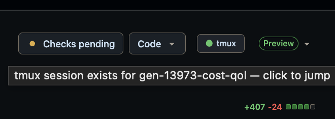

# pr-tmux-bridge

Jump from a GitHub PR (in the browser) to its tmux session. If no session
exists for the PR's branch, optionally spawn a worktree + tmux session on the
fly via a provisioning command you configure.



The injected `● tmux` button sits in the PR header. The dot shows status at a
glance: green = a session exists for the branch (click to jump), grey = none
(click to spawn one).

## Pieces

- `daemon/pr_tmux_bridge.py` — localhost HTTP daemon (Python 3, stdlib only)
- `userscript/pr-tmux-bridge.user.js` — Tampermonkey/Violentmonkey userscript
  that injects a `→ tmux` button on GitHub PR pages
- `launchd/be.lizy.pr-tmux-bridge.plist` — launchd template (substituted by
  `install.sh`)
- `install.sh` — installs the launchd agent
- `scripts/create-worktree.sh` — reference provisioning command (see below)

## Install (macOS)

```bash
./install.sh
```

Then install the userscript by opening the daemon's self-hosted copy (which
bakes in the auth token):

```bash
open 'http://127.0.0.1:47811/userscript.js'
```

Tampermonkey will prompt to confirm the install. Open any GitHub PR and the
`● tmux` button should appear next to the PR title.

Do **not** hand-paste `userscript/pr-tmux-bridge.user.js`: its token is a
`__TOKEN__` placeholder and the daemon will reject it with 401. Always install
from the daemon URL. Tampermonkey auto-updates from the same URL (`@updateURL`),
so future versions land with one "Check for userscript updates" click.

## Uninstall

```bash
./install.sh --uninstall
```

## How it works

1. Userscript injects a button on `github.com/*/*/pull/*` pages and queries
   `/status` to color the dot.
2. Click → `GET /open-pr/<owner>/<repo>/<num>`.
3. Daemon resolves the PR's head branch via `gh pr view`.
4. Daemon looks up a matching session by scanning `tmux list-sessions` and
   checking each session's checkout via `git rev-parse`. This returns the exact
   tmux session name (emoji prefix and all), no matter how the session was made.
5. If found: `tmux switch-client -t <session>` + activate the terminal app.
   If no client is attached: open a new terminal window running `tmux attach`.
6. If not found: userscript shows a confirm dialog. On yes, calls `/spawn/...`,
   which fast-forwards the local branch to `origin/<branch>`, runs the configured
   create command, then attaches.

## Provisioning command

`CREATE_COMMAND` (in the config file) is what spawns the worktree + tmux
session — there's no built-in default. It runs with cwd set to the repo root;
the tokens `{branch}` and `{repo_root}` are substituted as whole argv elements
after `shlex.split` (no shell, so a branch name can't be interpreted as a
command). The other settings are exported to it as `PR_TMUX_BRIDGE_*` env vars.

`install.sh` seeds it with the bundled reference script, which does
`git worktree add` + `tmux new-session`:

```
CREATE_COMMAND=/abs/path/scripts/create-worktree.sh {branch}
```

Swap it for any worktree manager — anything that provisions a checkout on
`{branch}` and starts a tmux session in it works; the daemon just polls until a
session for the branch appears.

## Repo resolution

`/spawn` needs the PR's local clone. It's resolved in order:

1. the `REPOS` override map
2. `<root>/<repo>` by convention (for each `WORKSPACE` search root)
3. a scan of each search root matching the clone's `origin` remote URL against
   `owner/repo` — so it works even when the local folder name differs from the
   GitHub repo name

## Security

The daemon binds to `127.0.0.1` only. All endpoints except `/health` and
`/userscript.js` require an `X-PR-Tmux-Token` header matching the secret in
`~/.config/pr-tmux-bridge/token` (generated on first run, mode 0600). The
daemon injects that token into the userscript when serving `/userscript.js`.
Requests with a non-loopback `Host` header are rejected (DNS-rebinding
defense), and CORS preflights are denied (the userscript uses
`GM.xmlHttpRequest`, which bypasses CORS, so a preflight only ever comes from a
cross-site `fetch` probe).

## Configuration

All settings live in `~/.config/pr-tmux-bridge/config` as `KEY=value` lines
(`#` starts a comment), each overridable by an env var `PR_TMUX_BRIDGE_<KEY>`.
The file is read live, so edits take effect without restarting the daemon — no
launchd plist editing. `install.sh` seeds it on first install.

| Key | Default | Purpose |
|---|---|---|
| `CREATE_COMMAND` | (none) | command that provisions a worktree + tmux session (see above) |
| `TERMINAL_APP` | `Ghostty` | terminal app to focus / spawn |
| `WORKSPACE` | `~/workspace` | search root(s) for clones (`os.pathsep`-separated) |
| `WORKTREE_BASE` | `~/wt` | worktree location for `scripts/create-worktree.sh` |
| `REPOS` | `{}` | JSON map `{"owner/repo": "/path/to/clone"}` for clones not found otherwise |

## Endpoints

| Method | Path | Auth | Returns |
|---|---|---|---|
| GET | `/health` | no | `{ok: true}` |
| GET | `/userscript.js` | no | userscript with token injected |
| GET | `/status/<owner>/<repo>/<num>` | yes | `{found, branch, session?}` (read-only) |
| GET | `/open-pr/<owner>/<repo>/<num>` | yes | `{found, branch, session?}` (+ attaches) |
| GET | `/spawn/<owner>/<repo>/<branch>` | yes | `{spawned, branch, session, repo_root}` |

## Portability

macOS-only today. The portable bits (userscript, daemon HTTP, gh/tmux/git
shell-outs) are isolated; the OS-specific bits (`focus_terminal`,
`attach_session` when no client, launchd plist) are confined to small
functions and can be swapped for Linux (`wmctrl`/`gnome-terminal` + systemd
user unit) or Windows (`wt.exe` + Task Scheduler) later.
